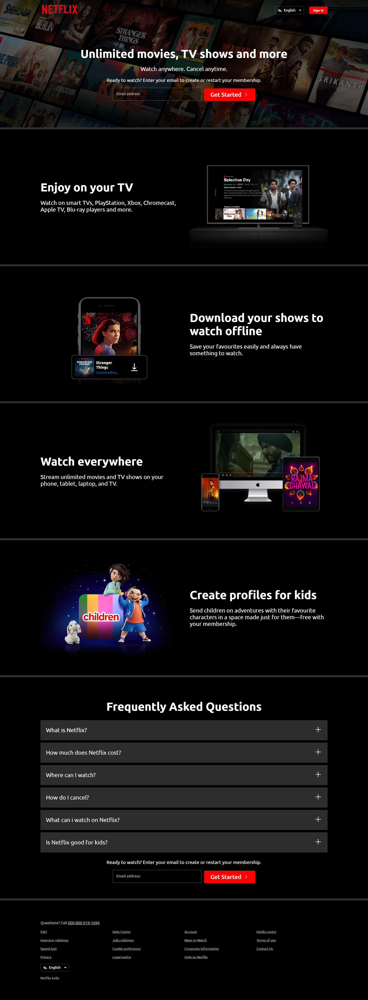
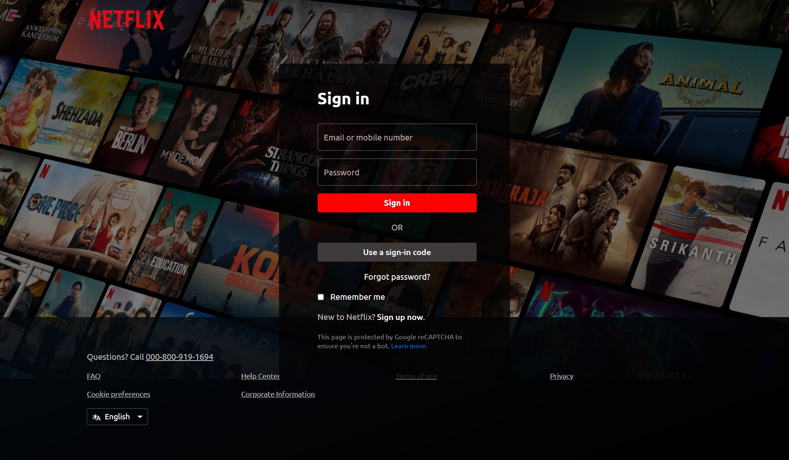

# 📺 Netflix Landing Page & Login Page Clone

## 📌 Project Description

This project is a **clone of Netflix's landing page and login page**, built using **HTML, CSS, and JavaScript**. It mimics the look and feel of the original Netflix interface with a modern, clean, and responsive design. This is a great project for beginners to practice front-end web development and UI design skills.

---

## 🚀 Features

- 📱 **Responsive Design** — Compatible with mobile, tablet, and desktop devices.
- 🎨 **Netflix-style Landing Page** — Includes background image, logo, headings, and a call-to-action button.
- 🔐 **Login Page Clone** — Email/phone input, password input, Remember Me option, and Sign In button.
- ✨ **Hover Effects & Animations** — Smooth CSS transitions for interactive elements.
- ⚙️ **Simple, Clean Code** — Purely developed using HTML, CSS, and vanilla JavaScript.

---

## 📷 Screenshots

### 📺 Landing Page

### 🔐 Login Page

> 📌 _Make sure to place your actual screenshots inside a `screenshots/` folder and update the file names if needed._

---

## 🛠️ Tools & Technologies

- **HTML5**
- **CSS3**
- **JavaScript (Vanilla)**

---

## 📂 Folder Structure

---

## 💡 How to Run

1. **Clone or download** this repository to your local system.
2. Open the `index.html` file in your browser to view the landing page.
3. Open the `login.html` file in your browser to view the login page.

---

## 🎯 Future Improvements

- Integrate real backend authentication (using Node.js, Firebase, or other tools)
- Add a signup page
- Display error and success messages on login validation
- Include a dynamic video background on the landing page

---

## 📣 Author

[GitHub Profile](https://github.com/yourgithub)

---
